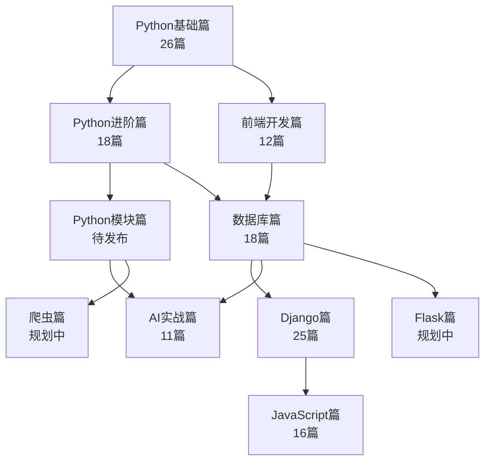

<div align="center">

# Python全栈入门到实战

**从零基础到全栈工程师的完整学习路线**

</div>

<div align="center">

   

</div>

---

## 🏆 Python全栈入门到实战 导航

### 专栏简介

本文是[《Python全栈入门到实战》](https://blog.csdn.net/zsh_1314520/category_13108073.html)专栏的导航贴，建议在学习本专栏时使用本篇导航，本文对专栏文章进行了系统归类和排序，让学习更有条理。

专栏特色：

- 保姆级教程：从零基础到全栈开发者，每一步都有详细讲解
- 实战驱动：边学边练，每个知识点都配有代码示例和实战项目
- 体系完整：覆盖 Python后端 + 前端 + 数据库 + AI应用 全栈技能链
- 项目落地：包含博客系统、教育平台、AI聊天助手等多个完整项目
- 持续更新：内容将不断丰富完善

适合人群：

- 零基础想要入门编程的新手
- 想要转型Python全栈开发的程序员
- 想要快速上手Web开发的学生和从业者
- 对AI应用开发感兴趣的开发者

### 专栏结构

专栏文章分以下几个部分展开：

1. [Python基础篇](#一python基础篇26篇)

    - **简介**：从零开始系统学习Python编程语言，包含环境搭建、基础语法、数据类型、流程控制、函数、文件操作、高级特性、模块与包等完整知识体系，适合零基础入门。

2. [Python进阶篇](#二python进阶篇18篇)

    - **简介**：深入学习面向对象编程（封装、继承、多态）、设计模式、并发编程（多线程、多进程、协程）、网络编程（Socket、TCP/UDP）等高级主题。

3. [Python模块篇](#三python模块篇待发布)

    - **简介**：精选Python常用核心模块进行深入讲解，包括随机数、时间处理、图形绘制、中文分词等实战模块。

4. [前端开发篇](#四前端开发篇12篇待发布)

    - **简介**：系统学习HTML/CSS前端开发技能，从基础标签到现代布局方案（Flex、Grid），最终完成一个完整的技术博客网站实战。

5. [数据库篇](#五数据库篇18篇)

    - **简介**：完整涵盖MySQL关系型数据库的核心知识，从安装配置到SQL语法、查询优化、事务处理、多表操作等企业级开发必备技能。

6. [AI实战篇](#六ai实战篇11篇)

    - **简介**：基于DeepSeek API + Streamlit，从零构建一个完整的AI聊天助手应用，涵盖API调用、会话记忆、流式输出、前端交互等核心技能。

7. [Django篇](#七django篇25篇待发布)

    - **简介**：从Django框架基础到高级开发技巧，包含MTV模式、ORM、模板系统、RESTful API开发，并完成博客系统和教育平台两个完整项目实战，最后讲解生产环境部署。

8. [JavaScript篇](#八javascript篇16篇待发布)

    - **简介**：系统学习JavaScript语言，从基础语法到ES6+特性、DOM操作、事件处理、异步编程，最终完成交互式数据看板项目实战。

9. [Flask篇（规划中）](#九flask篇规划中)

    - **简介**：从零学习Flask轻量级Web框架，包含路由、模板、数据库集成、蓝图、RESTful API开发等，适合快速构建中小型Web应用。

10. [爬虫篇（规划中）](#十爬虫篇规划中)
- **简介**：系统学习Python网络爬虫技术，包含requests、BeautifulSoup、XPath、Scrapy框架、反爬策略、分布式爬虫等，培养完整的数据采集能力。

（可点击上述目录，跳转到本文相应部分！）

---

### 学习路线图



---

### 各部分文章列表

**一、Python基础篇（26篇）**

从零开始，打好Python编程基础。从环境搭建到高级特性，系统掌握Python核心语法。

- 第1篇：《[Python初识：定位、优势与发展历程](https://blog.csdn.net/zsh_1314520/article/details/156536163)》
- 第2篇：《[环境搭建：Python解释器与PyCharm、VSCode编辑器安装配置详解](https://blog.csdn.net/zsh_1314520/article/details/156536391)》
- 第3篇：《[入门实操：第一个Python程序 + PyCharm使用 + 输入输出全解析](https://blog.csdn.net/zsh_1314520/article/details/156656860)》
- 第4篇：《[核心基础：变量与4种基础数据类型（int/float/str/bool）](https://blog.csdn.net/zsh_1314520/article/details/156657412)》
- 第5篇：《[核心基础：Python的2种运行模式（交互式+命令行式）](https://blog.csdn.net/zsh_1314520/article/details/156698390)》
- 第6篇：《[核心工具+数据结构：cd命令、列表(list)、元组(tuple)](https://blog.csdn.net/zsh_1314520/article/details/156719165)》
- 第7篇：《[运算符详解：算术、比较、逻辑与赋值运算全解析](https://blog.csdn.net/zsh_1314520/article/details/157024091)》
- 第8篇：《[进制和进制的转换](https://blog.csdn.net/zsh_1314520/article/details/157064581)》
- 第9篇：《[Python位运算（二进制位级操作核心）](https://blog.csdn.net/zsh_1314520/article/details/157098238)》
- 第10篇：《[字符串高级操作：从文本处理到高效清洗](https://blog.csdn.net/zsh_1314520/article/details/157212166)》
- 第11篇：《[字符编码：彻底解决文本乱码的底层逻辑](https://blog.csdn.net/zsh_1314520/article/details/157327045)》
- 第12篇：《[流程控制：条件判断（if-elif-else）与模式匹配（match-case）](https://blog.csdn.net/zsh_1314520/article/details/157359983)》
- 第13篇：《[复合数据类型：字典（键值映射）与集合（无序去重）](https://blog.csdn.net/zsh_1314520/article/details/157434261)》
- 第14篇：《[循环结构：for/while循环 + 循环控制（break/continue）](https://blog.csdn.net/zsh_1314520/article/details/157556030)》
- 第15篇：《[函数基础：内置函数调用 + 自定义函数（定义/参数/返回值）](https://blog.csdn.net/zsh_1314520/article/details/157651759)》
- 第16篇：《[字符串核心进阶：格式化方法（%/format/f-string）](https://blog.csdn.net/zsh_1314520/article/details/157807356)》
- 第17篇：《[循环进阶：推导式大全（列表/字典/集合）](https://blog.csdn.net/zsh_1314520/article/details/157911088)》
- 第18篇：《[程序健壮性核心：异常处理（try-except-finally/raise/断言）](https://blog.csdn.net/zsh_1314520/article/details/158180864)》
- 第19篇：《[函数进阶：默认参数、递归函数与偏函数应用](https://blog.csdn.net/zsh_1314520/article/details/158351819)》
- 第20篇：《[文件操作核心：读取、写入与管理](https://blog.csdn.net/zsh_1314520/article/details/158351897)》
- 第21篇：《[Python高级特性：切片与迭代（核心用法与实战）](https://blog.csdn.net/zsh_1314520/article/details/158694729)》
- 第22篇：《[生成器与迭代器：底层逻辑与实战场景](https://blog.csdn.net/zsh_1314520/article/details/158694891)》
- 第23篇：《[函数式编程：高阶函数与匿名函数](https://blog.csdn.net/zsh_1314520/article/details/159117567)》
- 第24篇：《[闭包与装饰器：Python函数式编程的核心进阶](https://blog.csdn.net/zsh_1314520/article/details/159117650)》
- 第25篇：《[模块与包：导入机制 + 第三方模块安装（pip 配置）](https://blog.csdn.net/zsh_1314520/article/details/159212742)》
- 第26篇：《[pip命令大全：第三方库管理全攻略](https://blog.csdn.net/zsh_1314520/article/details/159212799)》

---

**二、Python进阶篇（18篇）**

面向对象 + 并发编程 + 网络编程，进阶高级开发者。

- 第1篇：《[类与对象：面向对象编程的基石](https://blog.csdn.net/zsh_1314520/article/details/159250546)》
- 第2篇：《[面向对象之封装：私有属性、私有方法与@property优雅访问](https://blog.csdn.net/zsh_1314520/article/details/159250661)》
- 第3篇：《[面向对象之继承：代码复用与功能扩展](https://blog.csdn.net/zsh_1314520/article/details/159348978)》
- 第4篇：《[面向对象之多态：统一接口与灵活实现](https://blog.csdn.net/zsh_1314520/article/details/159349032)》
- 第5篇：《[面向对象高级技巧：@property进阶与方法分类](https://blog.csdn.net/zsh_1314520/article/details/159505174)》
- 第6篇：《[面向对象高级特性：抽象类与接口](https://blog.csdn.net/zsh_1314520/article/details/159725160)》
- 第7篇：《[面向对象实战：小型学生管理系统V2.0（整合所有知识点）](https://blog.csdn.net/zsh_1314520/article/details/159927754)》
- 第8篇：《[面向对象高级补充：枚举类（Enum）——告别魔法数字与硬编码](https://blog.csdn.net/zsh_1314520/article/details/160102961)》
- 第9篇：《[四大常用设计模式：工厂/单例/装饰器/观察者](https://blog.csdn.net/zsh_1314520/article/details/160136474)》
- 第10篇：《[Python多线程编程：从入门到实战（附线程安全/锁/通信实战）](https://blog.csdn.net/zsh_1314520/article/details/160223740)》
- 第11篇：《[Python线程池编程：从入门到实战（附批量爬虫/文件处理实战）](https://blog.csdn.net/zsh_1314520/article/details/160249894)》
- 第12篇：《[Python多进程编程：从入门到实战（附CPU密集型任务实战）](https://blog.csdn.net/zsh_1314520/article/details/160363879)》
- 第13篇：《[Python混合并发编程：多进程+多线程（搞定CPU+IO混合密集型任务）](https://blog.csdn.net/zsh_1314520/article/details/160407288)》
- 第14篇：《[Python协程编程：async/await吃透超高并发IO密集型任务](https://blog.csdn.net/zsh_1314520/article/details/160472346)》
- 第15篇：《[网络编程前置核心：吃透IP地址与端口号，掌握网络通信的双核心标识](https://blog.csdn.net/zsh_1314520/article/details/160550744)》
- 第16篇：《[TCP网络编程核心实战：基于Socket实现可靠通信，掌握跨设备数据传输的核心逻辑](https://blog.csdn.net/zsh_1314520/article/details/160989218)》
- 第17篇：《[UDP网络编程核心实战：基于Socket实现无连接通信，对比TCP掌握全栈选型逻辑](https://blog.csdn.net/zsh_1314520/article/details/161384528)》
- 第18篇：《[TCP多用户聊天室项目实战：基于Socket和多线程实现完整聊天系统，掌握网络编程综合应用开发](https://blog.csdn.net/zsh_1314520/article/details/161491731)》

---

**三、Python模块篇（待发布）**

精选Python常用核心模块进行深入讲解，包括随机数、时间处理、图形绘制、中文分词等实战模块，掌握Python生态的核心工具集。

---

**四、前端开发篇（待发布）**

系统学习HTML/CSS前端开发技能，从基础标签到现代布局方案（Flex、Grid），最终完成一个完整的技术博客网站实战，全栈开发者必备。

---

**五、数据库篇（18篇）**

MySQL从入门到精通，数据库核心技能全覆盖。从安装配置到SQL语法、查询优化、事务处理、多表操作等企业级开发必备。

- 第1篇：《[数据库核心概念全解：吃透数据存储底层逻辑，掌握全栈开发的数据库选型与基础认知](https://blog.csdn.net/zsh_1314520/article/details/161652757)》
- 第2篇：《[Windows系统MySQL安装超详细保姆级教程，零基础零报错全流程实操](https://blog.csdn.net/zsh_1314520/article/details/161718192)》
- 第3篇：《[MySQL服务启停与客户端连接全解，全栈开发数据库操作前置必备](https://blog.csdn.net/zsh_1314520/article/details/161791058)》
- 第4篇：《[SQL核心基础：数据模型、通用语法与四大分类全解，全栈开发SQL入门必备](https://blog.csdn.net/zsh_1314520/article/details/161996803)》
- 第5篇：《[DDL数据定义语言全解：库表全生命周期管理与全栈开发实战规范](https://blog.csdn.net/zsh_1314520/article/details/162033323)》
- 第6篇：《[使用PyCharm作为MySQL图形化工具，无需额外安装第三方软件](https://blog.csdn.net/zsh_1314520/article/details/162073132)》
- 第7篇：《[MySQL DML数据操作详解（增删改），数据库核心操作必掌握](https://blog.csdn.net/zsh_1314520/article/details/162210211)》
- 第8篇：《[MySQL DQL基本查询与条件查询详解，数据库最常用操作](https://blog.csdn.net/zsh_1314520/article/details/162233307)》
- 第9篇：《[MySQL DQL聚合函数与分组查询详解，数据统计分析核心](https://blog.csdn.net/zsh_1314520/article/details/162267273)》
- 第10篇：《[MySQL DQL排序查询与分页查询详解，前端列表展示必备技能](https://blog.csdn.net/zsh_1314520/article/details/162302826)》
- 第11篇：《[MySQL DCL用户管理与权限控制详解，数据库安全核心](https://blog.csdn.net/zsh_1314520/article/details/162464189)》
- 第12篇：《[MySQL常用内置函数详解，数据处理与业务逻辑必备](https://blog.csdn.net/zsh_1314520/article/details/163054717)》
- 第13篇：《[MySQL约束详解，数据完整性与一致性的核心保障](https://blog.csdn.net/zsh_1314520/article/details/163079972)》
- 第14篇：《[MySQL多表关系与笛卡尔积详解，数据库设计的核心基础](https://blog.csdn.net/zsh_1314520/article/details/163112457)》
- 第15篇：《[MySQL多表连接查询与联合查询详解，跨表数据查询全掌握](https://blog.csdn.net/zsh_1314520/article/details/163130625)》
- 第16篇：《[MySQL子查询详解，嵌套查询的四种类型与实战](https://blog.csdn.net/zsh_1314520/article/details/163373495)》
- 第17篇：《[MySQL事务详解，数据一致性与并发安全的核心保障](https://blog.csdn.net/zsh_1314520/article/details/163373603)》
- 第18篇：《[MySQL事务隔离级别详解，并发数据安全的核心控制](https://blog.csdn.net/zsh_1314520/article/details/163373625)》

---

**六、AI实战篇（11篇）**

基于DeepSeek API + Streamlit，从零构建一个完整的AI聊天助手应用。

- 第1篇：《[DeepSeek官方API全流程实战，第一个AI项目前置必备](https://blog.csdn.net/zsh_1314520/article/details/163644578)》
- 第2篇：《[APIFOX安装与使用全流程实战，第一个AI项目接口调试必备](https://blog.csdn.net/zsh_1314520/article/details/163644746)》
- 第3篇：《[利用APIFOX调用DeepSeek API全流程实战，第一个AI项目接口调试核心](https://blog.csdn.net/zsh_1314520/article/details/163674724)》
- 第4篇：《[DeepSeek API会话记忆实现全攻略，第一个AI项目连续对话核心](https://blog.csdn.net/zsh_1314520/article/details/163706258)》
- 第5篇：《[提示词工程零基础全攻略，第一个AI项目效果提升核心](https://blog.csdn.net/zsh_1314520/article/details/163706370)》
- 第6篇：《[基于Streamlit构建AI聊天消息展示模块，第一个AI项目前端交互核心](https://blog.csdn.net/zsh_1314520/article/details/163720894)》
- 第7篇：《[AI应用会话记忆功能全实现，第一个AI项目连续对话核心](https://blog.csdn.net/zsh_1314520/article/details/163779577)》
- 第8篇：《[AI智能助手流式输出全流程实战，第一个AI项目体验优化核心](https://blog.csdn.net/zsh_1314520/article/details/163831596)》
- 第9篇：《[AI应用侧边栏制作，第一个AI项目个性化配置核心](https://blog.csdn.net/zsh_1314520/article/details/163831675)》
- 第10篇：《[AI应用会话管理功能完整实现，第一个AI项目数据持久化核心](https://blog.csdn.net/zsh_1314520/article/details/163862439)》
- 第11篇：《[小辉AI聊天助手项目完整总结，第一个AI项目收官篇](https://blog.csdn.net/zsh_1314520/article/details/163862506)》

---

**七、Django篇（待发布）**

从Django框架基础到高级开发技巧，包含MTV模式、ORM、模板系统、RESTful API开发，并完成博客系统和教育平台两个完整项目实战，最后讲解生产环境部署。

---

**八、JavaScript篇（待发布）**

系统学习JavaScript语言，从基础语法到ES6+特性、DOM操作、事件处理、异步编程，最终完成交互式数据看板项目实战。

---

**九、Flask篇（规划中）**

从零学习Flask轻量级Web框架，包含路由、模板、数据库集成、蓝图、RESTful API开发等，适合快速构建中小型Web应用。与Django形成互补，掌握Python Web开发的双框架能力。

---

**十、爬虫篇（规划中）**

系统学习Python网络爬虫技术，从基础请求库到Scrapy分布式框架，培养完整的数据采集与处理能力。

---

### 学习路线建议

根据不同的学习目标，推荐以下学习路线：

**路线一：零基础入门 → Python后端开发**

```
基础篇(01-26) → 进阶篇(01-18) → 数据库篇(01-18) → Django篇(01-11)
```

适合人群：想从事Python后端开发的同学

**路线二：全栈开发者培养**

```
基础篇(01-26) → 进阶篇(01-09) → 前端篇(01-12) → 数据库篇(01-18)
→ Django篇(01-25) → JavaScript篇(01-16)
```

适合人群：想成为全栈工程师的同学

**路线三：Python + AI应用开发**

```
基础篇(01-26) → 进阶篇(01-09) → 模块篇 → AI实战篇(01-11)
```

适合人群：对AI应用开发感兴趣的同学

**路线四：快速就业突击**

```
基础篇(01-15) → 进阶篇(01-09) → 数据库篇(01-18)
→ Django篇(01-11) → JavaScript篇(01-10)
```

适合人群：时间有限，想快速掌握核心技能找工作的同学

**路线五：数据采集与分析方向**

```
基础篇(01-26) → 进阶篇(01-14) → 模块篇 → 爬虫篇(01-10)
```

适合人群：对数据采集、数据分析感兴趣的同学

---

### 支持作者

如果这个项目对你有帮助，欢迎请我喝杯咖啡。

你的支持是我持续更新的最大动力。

<table>
  <tr>
    <td align="center">
      <strong>微信支付</strong>
    </td>
    <td align="center">
      <strong>支付宝</strong>
    </td>
  </tr>
  <tr>
    <td>
      
    </td>
    <td>
      
    </td>
  </tr>
</table>

### 联系方式

- CSDN专栏：[Python全栈入门到实战](https://blog.csdn.net/zsh_1314520/category_13108073.html)
- GitHub：[shunhuizhang](https://github.com/shunhuizhang)

---

专栏持续更新中，只要宇宙不爆炸，更新永不停歇~
